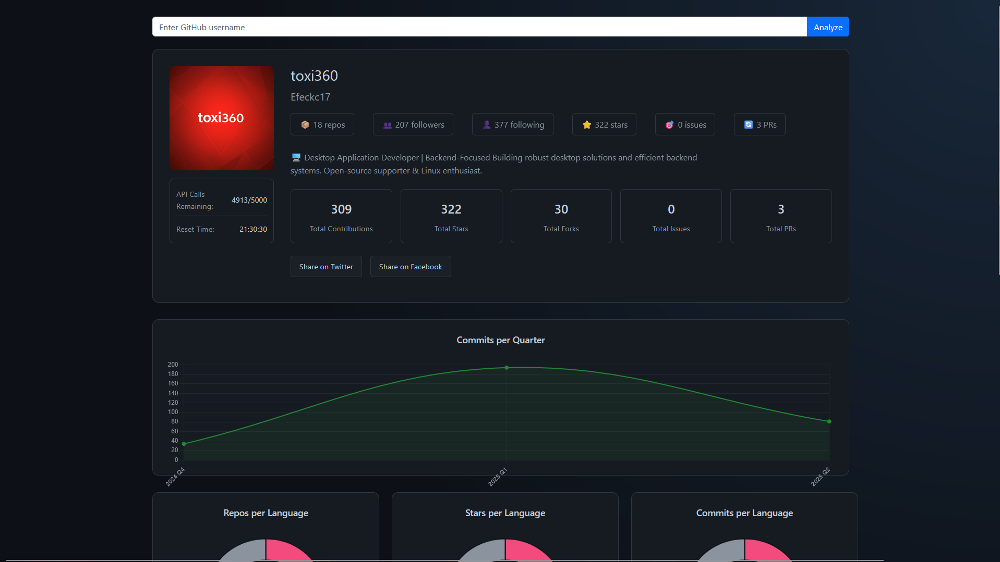

# GHAnalyzer

A Flask-based web application for visualizing detailed GitHub user statistics and analytics.



## Features

- 📊 Comprehensive GitHub profile analytics
- 📈 Interactive charts and visualizations
- 🔍 Detailed repository statistics
- 📅 Contribution history analysis
- 🌐 Language distribution insights
- ⭐ Top repositories overview
- 📊 Real-time API rate limit monitoring

## Quick Start

### Prerequisites

- Python 3.8 or higher
- GitHub Personal Access Token
- pip (Python package manager)

### Installation

1. Clone the repository:
```bash
git clone https://github.com/Efeckc17/GHAnalyzer.git
cd GHAnalyzer
```

2. Install required packages:
```bash
pip install -r requirements.txt
```

3. Create a `.env` file in the root directory and add your GitHub API token:
```
GITHUB_TOKEN=your_github_token_here
```

To obtain a GitHub API token:
1. Log in to your GitHub account
2. Go to Settings > Developer settings > Personal access tokens > Tokens (classic)
3. Click "Generate new token"
4. Grant at least "read:user" and "public_repo" permissions
5. Copy the generated token to your `.env` file

### Running the Application

```bash
python run.py
```

The application will be available at http://localhost:5000

## Features in Detail

### User Analytics
- Profile information and statistics
- Account age and activity metrics
- Follower and following counts
- Total contributions and activity patterns

### Repository Analysis
- Top repositories by stars
- Fork statistics
- Issue and pull request metrics
- Repository size and activity tracking

### Code Statistics
- Programming language distribution
- Commit history visualization
- Quarterly contribution patterns
- Code frequency analysis

### API Monitoring
- Real-time GitHub API rate limit tracking
- Remaining requests counter
- Rate limit reset timer

## Technical Stack

- **Backend**: Flask (Python)
- **Frontend**: HTML5, CSS3, JavaScript
- **Charts**: Chart.js
- **API**: GitHub REST API v3
- **Authentication**: GitHub Personal Access Token

## Contributing

Contributions are welcome! Please feel free to submit a Pull Request.

## License

This project is licensed under the MIT License - see the [LICENSE](LICENSE) file for details.

## Acknowledgments

- GitHub API for providing comprehensive access to user data
- Chart.js for beautiful data visualizations
- Flask community for the excellent web framework
